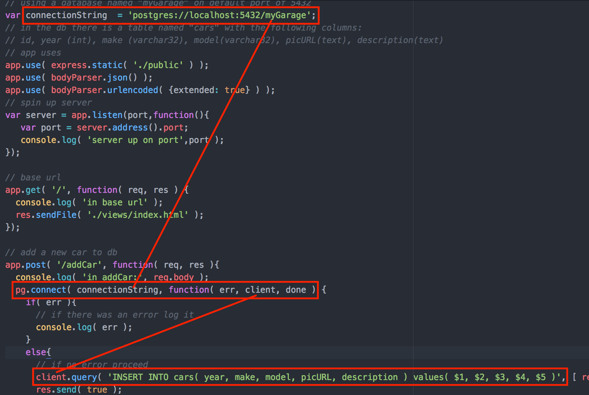

8 Bit Towers
============

SQL JQuery Node Express full stack example from in class.

Connection string should end with your database's name.
This allows you to connect to the db ('client' in the server code)

Use wildcards (start with $) to insert user input from req.body into columns in the table. 
